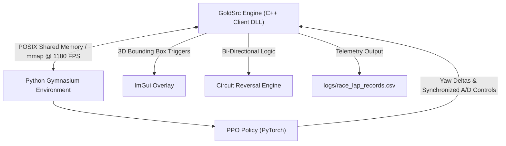
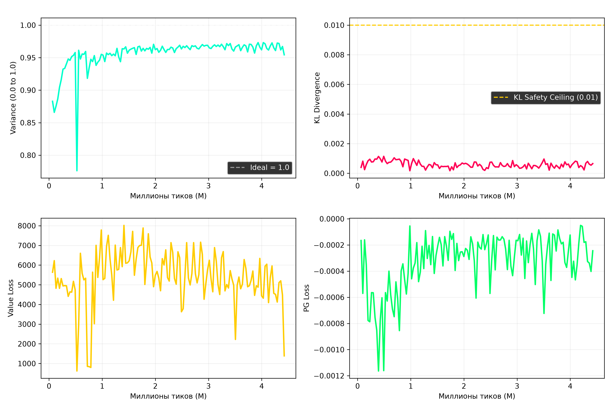

# AGDeepLearn: Autonomous High-Speed Air-Strafing & Bhop Agent for GoldSrc Engine

## Abstract

AGDeepLearn is a Deep Reinforcement Learning (DRL) framework engineered for high-speed locomotion, air-strafing, and dynamic spatial navigation within the GoldSrc game engine environment (Half-Life / Adrenaline Gamer).

The system integrates a C++ Client DLL with Python PyTorch via POSIX Shared Memory (`mmap`), achieving an evaluation and training throughput exceeding 1,180 frames per second (FPS).

---

## Technical Highlights & Quantitative Milestones

- **Velocity Baseline**: Achieved a continuous air-strafing velocity baseline exceeding 700 to 850 units per second.
- **Circuit Lap Optimization**: Reduced circuit lap execution time from 505.53 seconds to 106.92 seconds (a 4.7x speed improvement).
- **Policy Gradient Safeguards**: Implemented a custom `TargetKLEarlyStopping` callback (`target_kl = 0.01`) combined with learning rate scaling (`3e-5`), maintaining an Explained Variance of 0.9618 across 4.45M simulation steps without policy degradation.
- **Bi-Directional Circuit Training**: Implemented an automated 180-degree circuit direction reversal mechanism every two completed laps in C++ (`cl_dll/agent_api.cpp`), training both clockwise and counter-clockwise high-speed locomotion vectors.
- **IPC Performance**: Utilized zero-copy POSIX Shared Memory for inter-process communication, yielding an execution rate of 1,180+ FPS on single-threaded CPU evaluation.

---

## System Architecture



---

## Project Structure

```
.
├── OpenAG/
│   ├── cl_dll/
│   │   ├── agent_api.cpp      # C++ POSIX Shared Memory API, ImGui HUD, 3D Trigger & Reversal Engine
│   │   └── agent_api.h        # C++ Struct Definitions (Observation, Action)
├── AGDeepLearn/
│   ├── agdeeplearn/
│   │   ├── shm_client.py      # Python Shared Memory Inter-Process Communication
│   │   ├── openag_env.py      # Base Gymnasium Environment
│   │   └── rewards.py         # Locomotion Reward Formulation
│   ├── scripts/
│   │   ├── train_fine_tune_race.py # Fine-Tuning Trainer with KL Safeguards
│   │   ├── run_agent.py            # Autonomous Inference Runner
│   │   └── train_race_mode.py      # Circuit Navigation Trainer
│   ├── backups/
│   │   └── bhop_human_master_phase2_directional.zip # Pre-trained Model Weights
│   └── checkpoints/               # Evaluated Policy Checkpoints
```

---

## Performance Evaluation & Benchmarks



| Parameter | Observed Value | Target Value |
| :--- | :--- | :--- |
| **Locomotion Speed** | **700 – 850+ u/s** | > 700 u/s |
| **Circuit Lap Time** | **106.92s** | Minimum bound |
| **Explained Variance** | **0.9618 (96.18%)** | > 0.80 |
| **Approx KL Divergence** | **0.0006** | < 0.01 |
| **Simulation Throughput** | **1,180 FPS** | Maximal throughput |

---

## Deployment & Execution

### 1. Build Client DLL
```bash
cd OpenAG
cmake -B build -DCMAKE_BUILD_TYPE=Release
cmake --build build --config Release
```

### 2. Autonomous Inference Execution
```bash
cd AGDeepLearn
./.venv/bin/python3 scripts/run_agent.py
```

### 3. Model Fine-Tuning Execution
```bash
cd AGDeepLearn
./.venv/bin/python3 scripts/train_fine_tune_race.py --timesteps 10000000
```

---

## License
This repository is released under the MIT License.
